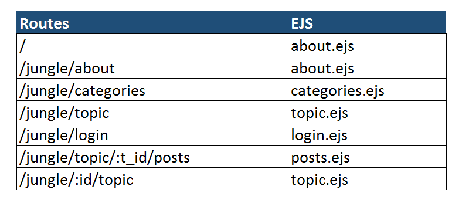

project2 :octocat: :thought_balloon:
#Study Buddy FORUM

##USER STORIES
* User can see all categories,topics and posts
* User can create user profile
* User can create new category
* User can create topics
* User can add comment on existing and new topics
* User can vote on topics
* User should see the most popular topic first
* User can see a mobile optimized version of the forum when he is visiting on the go

##BONUS FEATURES
 :heavy_plus_sign: User can comment on previous comments
 :heavy_plus_sign: User can post their current locations
 :heavy_plus_sign: User can format the content of the comment
 :heavy_plus_sign: User can add url for a picture as an avatar, or can slelect from basic avatars

##FRONT-END WIREFRAMES
**Web page layout**

**Mobile Layout**

##PSEUDOCODE :bar_chart:

##ROUTES

##ERD DATABASE DESIGN
###Database Design

##TECHNOLOGIES USED
:heart_eyes:SQLite3
:smiley:JavaScript
:smiley:HTML
:smiley:CSS
:smiley:Express

##AGILE
**KANBAN**

## DIGITAL OCEAN
[DO :droplet:](http://github.com)
